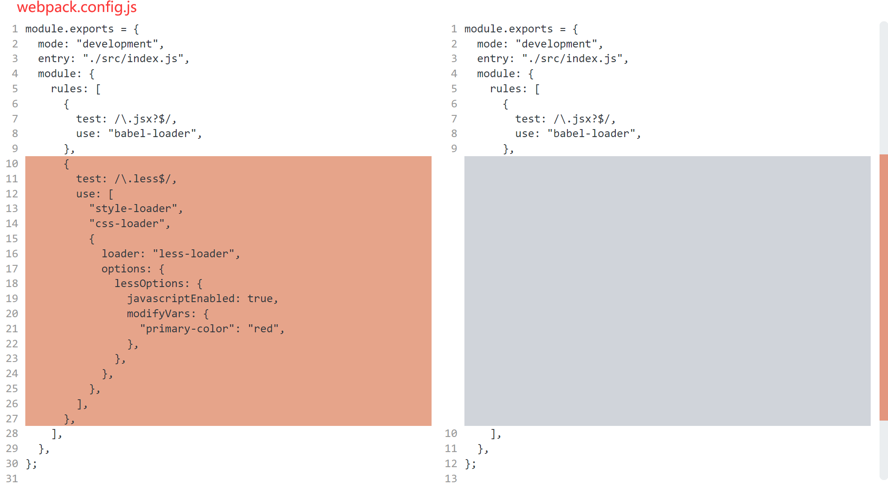
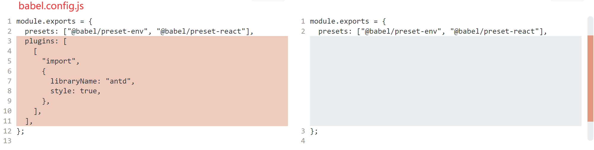
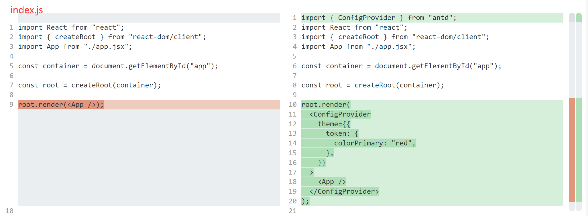

# antd v4 to v5

## 项目工程化配置中改动有三点

1. webpack.config.js：v5 中弃用 less，采用 CSS-in-JS，不需要 less-loader 来处理 antd 样式
   

2. babel.config.js：v5 中已经是按需加载了，不需要 babel-plugin-import 动态导入
   

3. index.js：v4 中在 webpack less-loader 中配置 modifyVars，v5 在 ConfigProvider 中对 theme token 配置
   

## [其他参考官网](https://ant.design/docs/react/migration-v5)
